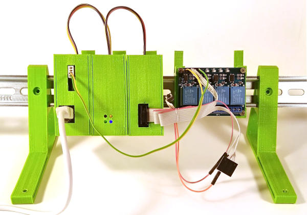

```diff
- THIS IS AN EXPERIMENTAL BRANCH! The code here may not compile, branch can be
- force-pushed or dragons can eat your lunch! Don't assume anything about this branch!
```


PeaLC's main purpose is to be the lowest-possible-barrier entry point into
the world of PLC programming and automation in general. It's here for fun,
learning, hacking, experimentation, research and joy of tinkering.

It's up to you how you will use it. Have fun hacking!

## "The PeaLC Way"

PeaLC is designed according to these guidelines:
- fully open source firmware and hardware
- affordable
- standard [IEC 61131-3 languages][iec-61131-3] support ("PLC languages")
- can be built from scratch easily by anyone with modest hacking skills
- use existing available modules wherever possible

## Version 0 ("Aster" Line)

First prototype line to try out the overall concept. All basic system components
are in place, even when in an MVP form.

Components:
- one CAN bus for both internal and external communication
- [UAVCAN v.0][uavcan-v0] protocol
- CPU module based on ESP32
    - [OpenPLC][openplc]-core-based firmware
    - optional WiFi/MQTT communication
    - programmable using ladder logic or C
- IO module based on STM32F103C8 aka the [Blue Pill][blue-pill]
    - 8 I/O channels
    - every one of them can serve as a digital input or output
    - four of them can be configured as an analogue input or output (PWM)
    - no drivers or protection circuits - external modules are to be used
    - all channels are 3.3V, four of them are 5V-tolerant
- IO module based on ATmega328P (most frequently used Arduino chip) + MCP2515 (CAN driver)
    - mainly for driving external modules which need 5V logic
    - and to make use of a plethora of Arduino libraries
- parametrized 3D-printable cases with DIN rail mount
- HMI panel based on Android tablet and standard web application ([Vue.js][vue])

Repository: https://github.com/mprymek/PeaLC/tree/master
Stage: work in progress




## Legal

Everything in this repo is provided by the copyright holders and contributors "as is"
and any express or implied warranties, including, but not limited to, the
implied warranties of merchantability and fitness for a particular purpose
are disclaimed. In no event shall the copyright holder or contributors be
liable for any direct, indirect, incidental, special, exemplary, or
consequential damages (including, but not limited to, procurement of substitute
goods or services; loss of use, data, or profits; or business interruption)
however caused and on any theory of liability, whether in contract, strict
liability, or tort (including negligence or otherwise) arising in any way out
of the use of this software and other documents, even if advised of the possibility
of such damage.

If not explicitly stated otherwise, everything in this repo is licensed
under [The 3-Clause BSD License][bsd-license].

[blue-pill]: https://stm32-base.org/boards/STM32F103C8T6-Blue-Pill
[bsd-license]: https://opensource.org/licenses/BSD-3-Clause
[iec-61131-3]: https://en.wikipedia.org/wiki/IEC_61131-3
[openplc]: https://www.openplcproject.com/
[uavcan-v0]: https://uavcan.org/Specification/1._Introduction/
[vue]: https://vuejs.org/
