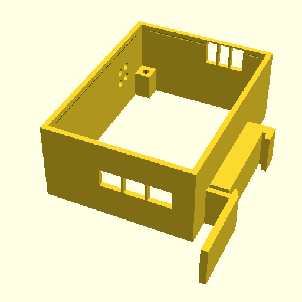
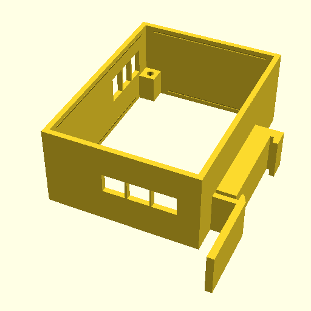
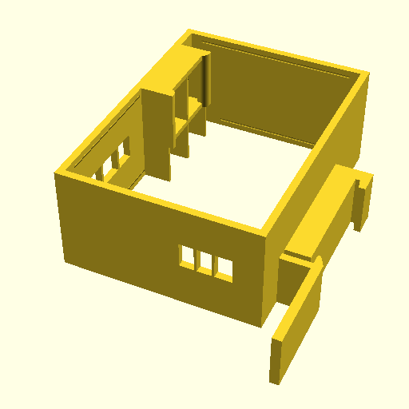
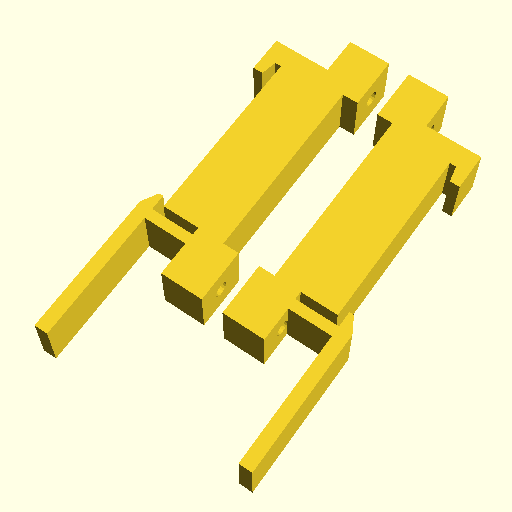

# PeaLC Modules 3D-Printable Cases

All cases are rendered using [OpenSCAD][openscad] from one common file
`lib/cases.scad`.

To render all cases:
```
$ make
```

## Cases Preview (with Printing Supports)

CPU module:



Blue Pill IO module:



Patchbox module:



Universal DIN rail mount (4-relays module variant):




## License

`Small_Single_Keystone_Jack_Faceplate.stl` was designed by Brian Miles (Starkadder)
and is licensed under [Creative Commons - Attribution][cc-attribution] license.
See https://www.thingiverse.com/thing:2668816

[cc-attribution]: https://creativecommons.org/licenses/by/3.0/
[openscad]: https://www.openscad.org/
